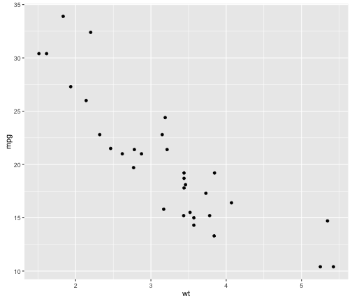

## Read-And-Delete

1. Edit YAML front matter
2. Write using R Markdown
3. Use an empty line followed by three dashes to separate slides!

--- .class #id 

## Slide 2

--- #montreal bg:url(https://www.yandex.com/images/today?size=1920x1080)
## Montreal by Night Time

--- #dillinger
<iframe width="400" height="225" frameborder="0"
  src="http://player.vimeo.com/video/1063136?title=0&amp;byline=0&amp;portrait=0" >
</iframe>

--- .middle 

Slidify is Awesome

## A Simple Plot 

---  plot #simple-plot
Let us create a simple scatterplot.


```r
require(ggplot2)
qplot(wt, mpg, data = mtcars)
```




